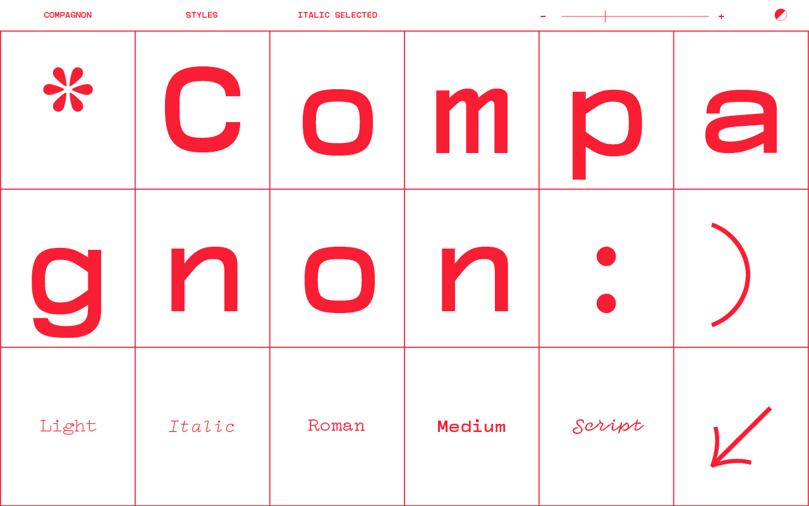
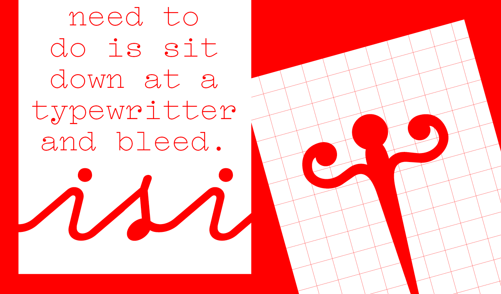
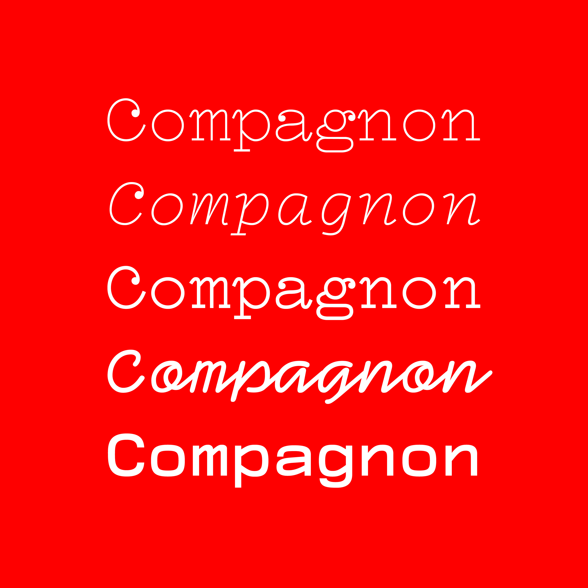
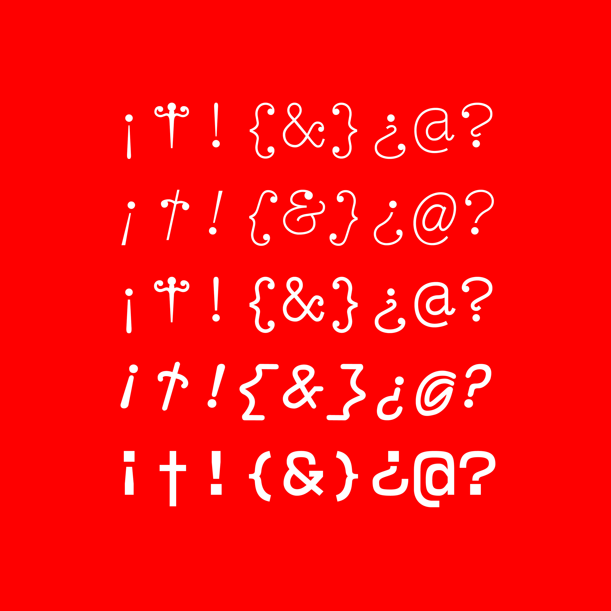

# Compagnon

### English
Compagnon is a typeface family composed of five distinctive styles. It finds its inspiration in the online archives of Typewriter Database specimens and combines different periods of the history of typewriter typefaces. Each weight is based on singular references relating to significant periods aiming to underline the evolution of typewriter characters as they are called.

Compagnon Light and Roman have been drawn by Juliette Duhé and Léa Pradine; Compagnon Italic by Valentin Papon; Compagon Medium by Sébastien Riollier and Compagnon Script by Chloé Lozano. Meet Compagnon. You can use it, modify it and redesign it freely on [Velvetyne Type Foundry](https://velvetyne.fr/fonts/compagnon/).

*Crédits:* EESAB-Rennes, Typography creation studio, Master Graphic Design, 2018. Made in France, Made in Brittany.

*Thanks:* Benjamin Gomez, Guillaume Allard and Typewriter Database

### Français
Compagnon est une famille de caractères composée de cinq styles. Elle trouve son inspiration sur l’archive de spécimens en ligne Typewriter Database et réunit différents moments de l’histoire des caractères dits typewriter. Chaque graisse s’appuie sur des références singulières relatives à des périodes significatives, témoignant de l’évolution des caractères dits typewriter.

Compagnon Light et Roman ont été dessiné par Juliette Duhé et Léa Pradine, Compagnon Italic par Valentin Papon, Compagnon Medium par Sébastien Riollier et Compagnon Script par Chloé Lozano. Faites connaissance avec Compagnon. Vous pouvez l’utiliser, la modifier et la redistribuer librement sur [Velvetyne Type Foundry](https://velvetyne.fr/fonts/compagnon/).

*Crédits :* EESAB-Rennes, Atelier de création de caractère, 5e Année, Design Graphique, 2018. Made in France, Made in Britanny.

*Remerciements :* Benjamin Gomez, Guillaume Allard ainsi que Typewriter Database

## Specimen

## License

Solide Mirage is licensed under the SIL Open Font License, Version 1.1.
This license is copied below, and is also available with a FAQ at
http://scripts.sil.org/OFL

## Repository Layout

This font repository follows the Unified Font Repository v2.0,
a standard way to organize font project source files. Learn more at
https://github.com/raphaelbastide/Unified-Font-Repository
