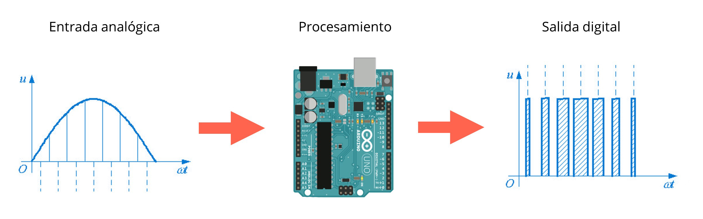
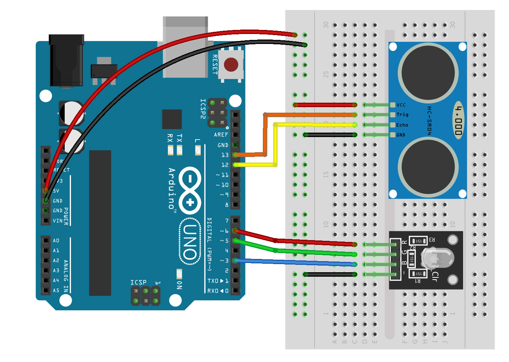

# clase 2

Sensores y actuadores

Jueves 11 agosto 2022

Hoy aprenderemos:

- Señales analógicas y digitales
- Modulación por ancho de pulsos (PWM)
- Componentes eléctricos, sensores y actuadores
- Sensores de luz, sonido y proximidad
- Programación en Arduino: Condicionales, mapeo de valores, pulso

## enlaces a ejemplos de esta clase

- [ejemplos/ej_03_rgb_digital/](./ejemplos/ej_03_rgb_digital/)
- [ejemplos/ej_04_rgb_analogico/](./ejemplos/ej_04_rgb_analogico/)
- [ejemplos/ej_05_rgb_ultrasonido/](./ejemplos/ej_05_rgb_ultrasonido/)

## datos digitales y analógicos

Datos digitales: valores de 1 o 0, dígito binario o bit (2 posibles valores)

Datos analógicos: rangos variables, Arduino procesa datos de 0 a 1023 (2^10)

## modulación por ancho de pulsos (PWM ~)

Permite variar tiempo de una señal digital con estado alto o bajo (5V o 0V) para controlar la cantidad de corriente que se entrega a los dispositivos, emulando una señal analógica.



## ejercicio 3: entrada y salida analógica (potenciómetro)


[ejemplos/ej_03_rgb_digital/](./ejemplos/ej_03_rgb_digital/)


## ejercicio 4: entrada y salida analógica (potenciómetro)


[ejemplos/ej_04_rgb_analogico/](./ejemplos/ej_04_rgb_analogico/)

## ejercicio 5: entrada y salida analógica (potenciómetro)



[ejemplos/ej_05_rgb_ultrasonido/](./ejemplos/ej_05_rgb_ultrasonido/)

## lectura de datos de pulso

Se almacena el pulso generado a partir de un pin y lo transforma en señal analógica 

```arduino
pulseIn(pinE, HIGH);
```
