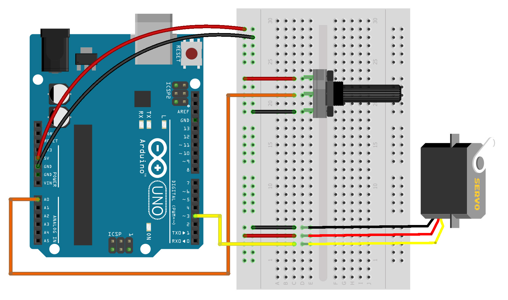

# clase 3

Movimiento, comunicación y autonomía de prototipos

Jueves 18 agosto 2022

Hoy aprenderemos:

- Uso e instalación de librerías
- Movimiento físico con motor servo
- Autonomía de prototipos electrónicos
- Comunicación serial con Processing

## enlaces a ejemplos de esta clase

- [ejemplos/ej_06_servo_analogico](./ejemplos/ej_06_servo_analogico/)
- [ejemplos/ej_07_servo_ultrasonido/](./ejemplos/ej_07_servo_ultrasonido/)
- [ejemplos/ej_08_datos_en_processing/](./ejemplos/ej_08_datos_en_processing/)

## uso e instalación de librerías

## ejercicio 6: motor servo y entrada analógica (potenciómetro)

[ejemplos/ej_06_servo_analogico/](./ejemplos/ej_06_servo_analogico/)

## ejercicio 7: motor servo y entrada por pulsos (sensor de proximidad)

[ejemplos/ej_07_servo_ultrasonido/](./ejemplos/ej_07_servo_ultrasonido/)

## ejercicio 8: comunicación serial y lectura de datos en Processing

[ejemplos/ej_08_datos_en_processing/](./ejemplos/ej_08_datos_en_processing/)
